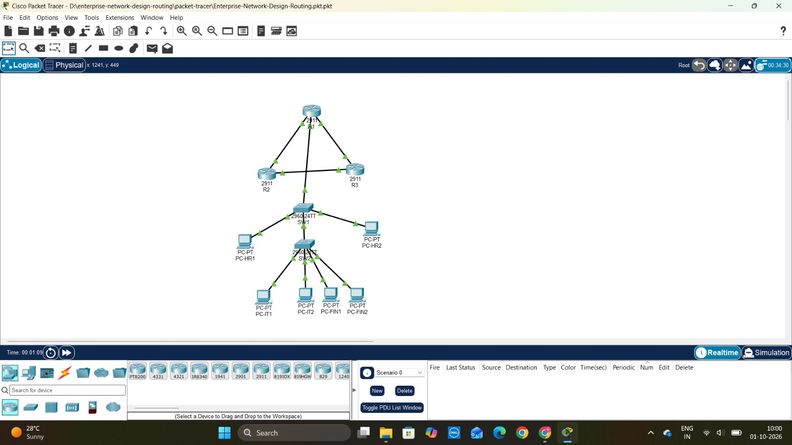
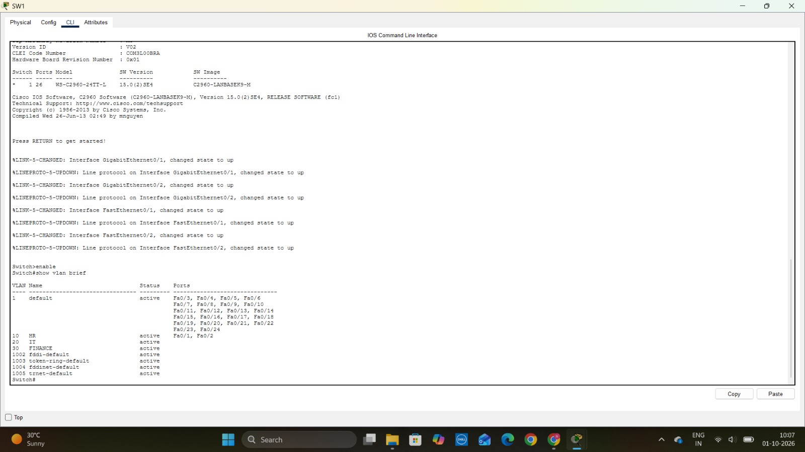
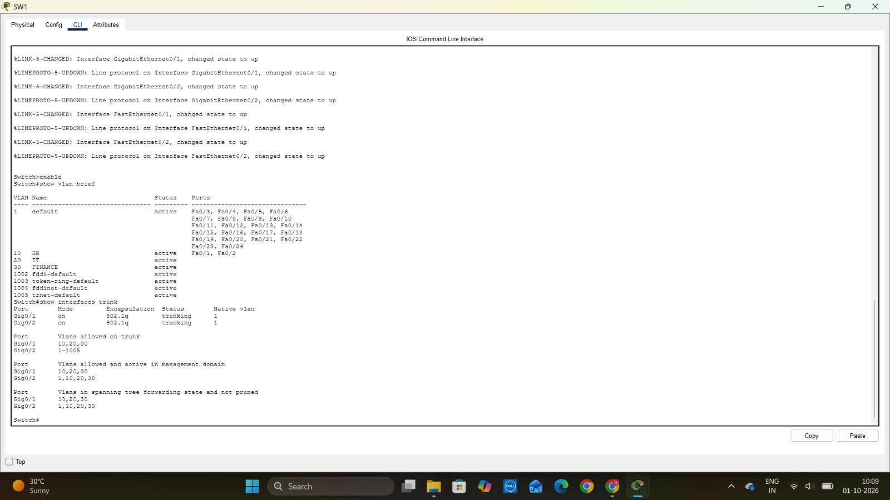
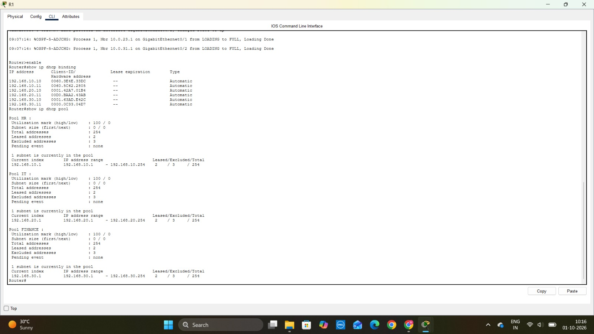
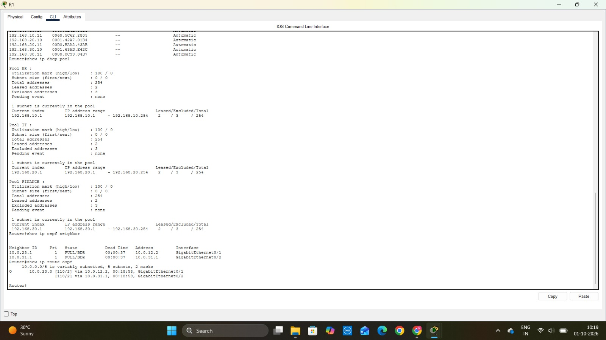
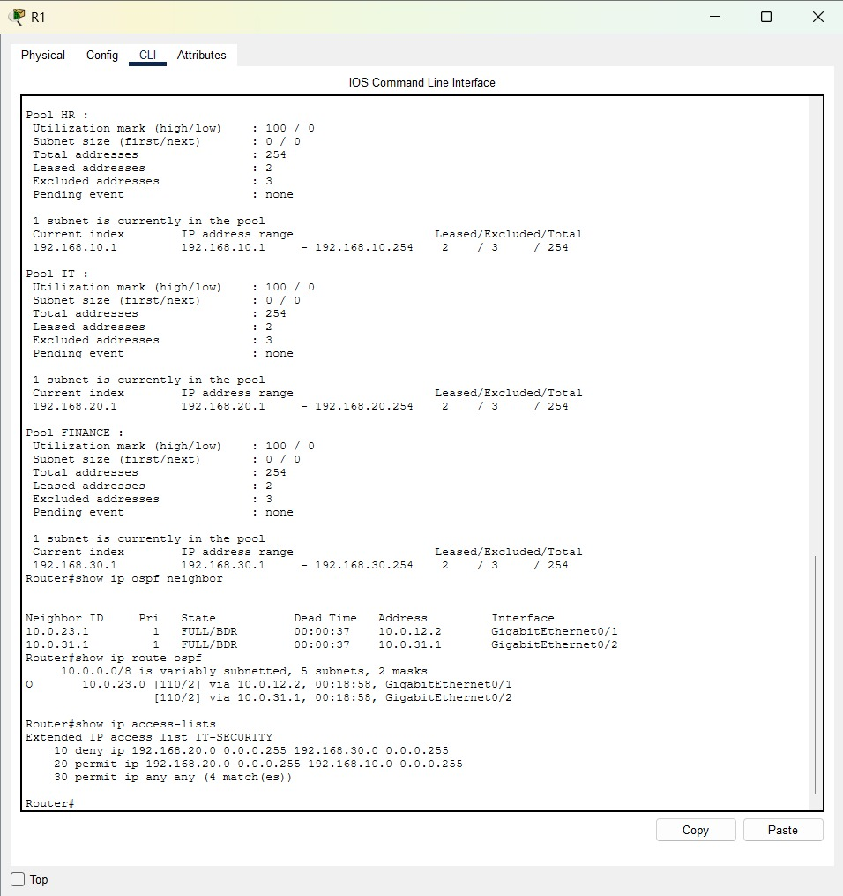

# Enterprise Network Design & Routing Simulation

A multi-router enterprise network simulation implemented using Cisco Packet Tracer.

This project demonstrates the design and implementation of a small enterprise network with departmental VLAN segmentation, inter-VLAN routing, DHCP, OSPF dynamic routing, 802.1Q trunking, and extended ACL-based access control.

---

## 📌 Project Overview

The simulated enterprise consists of three departments:

- Human Resources (HR)
- Information Technology (IT)
- Finance

The network uses VLANs to logically separate departmental traffic.

Two Layer 2 switches provide connectivity to the end devices, while three routers form the routed network core.

R1 additionally provides:

- Inter-VLAN routing
- DHCP services
- ACL-based traffic control

OSPF is used as the dynamic routing protocol between R1, R2, and R3.

---

## 🎯 Project Objectives

The main objectives of this project are:

- Design a small enterprise network topology
- Implement departmental VLAN segmentation
- Configure switch access ports
- Configure 802.1Q trunking
- Implement router-on-a-stick inter-VLAN routing
- Configure DHCP for automatic IPv4 address assignment
- Implement OSPF dynamic routing
- Configure an extended ACL for access control
- Verify end-to-end connectivity
- Test and troubleshoot network behavior
- Document the complete network configuration

---

# 🏗️ Network Topology

The network consists of:

### Routers

- R1
- R2
- R3

### Switches

- SW1
- SW2

### End Devices

#### HR

- PC-HR1
- PC-HR2

#### IT

- PC-IT1
- PC-IT2

#### Finance

- PC-FIN1
- PC-FIN2

### Topology Design

- R1 connects to SW1
- SW1 connects to SW2 using an 802.1Q trunk
- R1, R2, and R3 form the routed core
- HR devices are connected through VLAN 10
- IT devices are connected through VLAN 20
- Finance devices are connected through VLAN 30

---

## 🖼️ Network Topology



---

# 🔹 VLAN Design

The enterprise network is divided into three departmental VLANs.

| VLAN | Department | Network | Subnet Mask | Default Gateway |
|------|------------|---------|-------------|-----------------|
| 10 | HR | 192.168.10.0/24 | 255.255.255.0 | 192.168.10.1 |
| 20 | IT | 192.168.20.0/24 | 255.255.255.0 | 192.168.20.1 |
| 30 | Finance | 192.168.30.0/24 | 255.255.255.0 | 192.168.30.1 |

### VLAN 10 — HR

Contains:

- PC-HR1
- PC-HR2

### VLAN 20 — IT

Contains:

- PC-IT1
- PC-IT2

### VLAN 30 — Finance

Contains:

- PC-FIN1
- PC-FIN2

---

## VLAN Verification

The VLAN configuration was verified using:

```text
show vlan brief
```



---

# 🔹 Switching & 802.1Q Trunking

SW1 and SW2 operate as Layer 2 switches.

End-device ports are configured as access ports and assigned to their respective departmental VLANs.

The network uses IEEE 802.1Q trunking to transport multiple VLANs across the trunk links.

Configured VLANs:

```text
VLAN 10 - HR
VLAN 20 - IT
VLAN 30 - Finance
```

### Trunk Verification

The trunk configuration was verified using:

```text
show interfaces trunk
```



---

# 🔹 Inter-VLAN Routing

Inter-VLAN routing is implemented on R1 using the **router-on-a-stick** architecture.

R1 uses subinterfaces for each departmental VLAN:

```text
GigabitEthernet0/0.10
GigabitEthernet0/0.20
GigabitEthernet0/0.30
```

The corresponding gateway addresses are:

```text
VLAN 10 → 192.168.10.1
VLAN 20 → 192.168.20.1
VLAN 30 → 192.168.30.1
```

802.1Q encapsulation is configured on the subinterfaces.

This allows traffic to be routed between VLANs through R1.

---

# 🔹 DHCP Configuration

R1 provides DHCP services for all three departmental VLANs.

### HR DHCP Pool

```text
Network:         192.168.10.0/24
Default Gateway: 192.168.10.1
DNS Server:      8.8.8.8
```

### IT DHCP Pool

```text
Network:         192.168.20.0/24
Default Gateway: 192.168.20.1
DNS Server:      8.8.8.8
```

### Finance DHCP Pool

```text
Network:         192.168.30.0/24
Default Gateway: 192.168.30.1
DNS Server:      8.8.8.8
```

The first addresses of each subnet are excluded from DHCP to reserve them for gateway/infrastructure use.

### DHCP Verification

The DHCP configuration was verified using:

```text
show ip dhcp binding
show ip dhcp pool
```



The final network successfully assigned IPv4 addresses to all six end devices.

---

# 🔹 OSPF Dynamic Routing

OSPF is used as the dynamic routing protocol between R1, R2, and R3.

All three routers participate in **OSPF Area 0**.

### Router-to-Router Networks

| Link | Network | R1/R2/R3 Addresses |
|------|---------|---------------------|
| R1-R2 | 10.0.12.0/30 | R1: 10.0.12.1 / R2: 10.0.12.2 |
| R2-R3 | 10.0.23.0/30 | R2: 10.0.23.1 / R3: 10.0.23.2 |
| R1-R3 | 10.0.31.0/30 | R1: 10.0.31.2 / R3: 10.0.31.1 |

### OSPF Verification

OSPF neighbor relationships were verified using:

```text
show ip ospf neighbor
```

OSPF-learned routes were verified using:

```text
show ip route ospf
```

A successful OSPF adjacency reaches the:

```text
FULL
```

state.



---

# 🔹 Access Control List

An extended ACL named:

```text
IT-SECURITY
```

was configured on R1.

The security requirement implemented in the simulation is:

```text
IT → Finance = BLOCKED
IT → HR      = ALLOWED
```

### ACL Rules

The main deny rule is:

```text
deny ip 192.168.20.0 0.0.0.255 192.168.30.0 0.0.0.255
```

This blocks traffic originating from the IT network:

```text
192.168.20.0/24
```

to the Finance network:

```text
192.168.30.0/24
```

IT-to-HR traffic is explicitly permitted:

```text
permit ip 192.168.20.0 0.0.0.255 192.168.10.0 0.0.0.255
```

The remaining traffic is permitted using:

```text
permit ip any any
```

### ACL Verification

The ACL was verified using:

```text
show ip access-lists
```



### ACL Connectivity Test

From PC-IT1:

```text
ping 192.168.30.10
```

The traffic is blocked by the ACL.

From PC-IT1:

```text
ping 192.168.10.10
```

The traffic is permitted.

This demonstrates selective traffic control between departmental networks.

---

# 🌐 IP Addressing

## VLAN Networks

| VLAN | Department | Network | Gateway |
|------|------------|---------|---------|
| 10 | HR | 192.168.10.0/24 | 192.168.10.1 |
| 20 | IT | 192.168.20.0/24 | 192.168.20.1 |
| 30 | Finance | 192.168.30.0/24 | 192.168.30.1 |

## Router Interfaces

### R1

| Interface | IP Address | Purpose |
|-----------|------------|---------|
| G0/0.10 | 192.168.10.1 | HR Gateway |
| G0/0.20 | 192.168.20.1 | IT Gateway |
| G0/0.30 | 192.168.30.1 | Finance Gateway |
| G0/1 | 10.0.12.1 | R1-R2 OSPF Link |
| G0/2 | 10.0.31.2 | R1-R3 OSPF Link |

### R2

| Interface | IP Address | Purpose |
|-----------|------------|---------|
| G0/1 | 10.0.12.2 | R2-R1 OSPF Link |
| G0/2 | 10.0.23.1 | R2-R3 OSPF Link |

### R3

| Interface | IP Address | Purpose |
|-----------|------------|---------|
| G0/1 | 10.0.23.2 | R3-R2 OSPF Link |
| G0/2 | 10.0.31.1 | R3-R1 OSPF Link |

For the complete addressing plan, see:

[IP Addressing Table](docs/ip-addressing-table.md)

---

# 💻 End Device Addressing

The PCs receive their IPv4 addresses dynamically using DHCP.

| Device | Department | VLAN | IPv4 Address | Default Gateway |
|--------|------------|------|--------------|-----------------|
| PC-HR1 | HR | 10 | 192.168.10.10 | 192.168.10.1 |
| PC-HR2 | HR | 10 | 192.168.10.11 | 192.168.10.1 |
| PC-IT1 | IT | 20 | 192.168.20.10 | 192.168.20.1 |
| PC-IT2 | IT | 20 | 192.168.20.11 | 192.168.20.1 |
| PC-FIN1 | Finance | 30 | 192.168.30.10 | 192.168.30.1 |
| PC-FIN2 | Finance | 30 | 192.168.30.11 | 192.168.30.1 |

---

# 🔍 Network Verification

The completed network was verified using Cisco IOS commands.

### VLAN Verification

```text
show vlan brief
```

### Trunk Verification

```text
show interfaces trunk
```

### Interface Verification

```text
show ip interface brief
```

### DHCP Verification

```text
show ip dhcp binding
show ip dhcp pool
```

### OSPF Verification

```text
show ip ospf neighbor
show ip route ospf
```

### ACL Verification

```text
show ip access-lists
```

### Connectivity Testing

ICMP ping tests were performed between devices in different VLANs.

Examples:

```text
ping 192.168.10.1
ping 192.168.10.10
ping 192.168.20.10
ping 192.168.30.10
```

Testing confirmed:

- End devices can reach their VLAN gateways
- Inter-VLAN routing is operational
- OSPF adjacencies are established
- DHCP successfully assigns IPv4 addresses
- IT can communicate with HR
- IT-to-Finance traffic is restricted by the ACL

---

# 📁 Repository Structure

```text
enterprise-network-design-routing/
│
├── README.md
│
├── packet-tracer/
│   └── Enterprise-Network-Design-Routing.pkt
│
├── configs/
│   ├── R1-config.txt
│   ├── R2-config.txt
│   ├── R3-config.txt
│   ├── SW1-config.txt
│   └── SW2-config.txt
│
├── screenshots/
│   ├── network-topology.png
│   ├── vlan-verification.png
│   ├── trunk-verification.png
│   ├── dhcp-verification.png
│   ├── ospf-verification.png
│   └── acl-verification.png
│
└── docs/
    └── ip-addressing-table.md
```

---

# 🚀 How to Run the Project

### Prerequisites

Install:

- Cisco Packet Tracer

### Steps

1. Clone or download this repository.
2. Navigate to:

```text
packet-tracer/
```

3. Open:

```text
Enterprise-Network-Design-Routing.pkt
```

4. Inspect the network topology.
5. Open the routers and switches to review the configurations.
6. Use the verification commands documented in this README.
7. Test connectivity between the end devices.

---

# 🧠 Key Learning Outcomes

This project provided practical experience with:

- Enterprise network topology design
- IPv4 addressing
- Subnetting
- VLAN segmentation
- Access port configuration
- 802.1Q trunking
- Router-on-a-stick
- Inter-VLAN routing
- DHCP
- OSPF dynamic routing
- Extended ACLs
- ICMP connectivity testing
- Cisco IOS CLI
- Network troubleshooting
- Network verification
- Configuration documentation

---

# 🛠️ Technologies Used

- Cisco Packet Tracer
- Cisco IOS
- IPv4
- VLAN
- IEEE 802.1Q
- DHCP
- OSPF
- Extended ACL
- ICMP

---

# 📚 Project Documentation

Additional project documentation is available in:

```text
configs/
```

Contains the running configurations of:

- R1
- R2
- R3
- SW1
- SW2

```text
docs/
```

Contains the complete IP addressing plan.

```text
screenshots/
```

Contains topology and configuration verification evidence.

```text
packet-tracer/
```

Contains the final Cisco Packet Tracer simulation.

---
